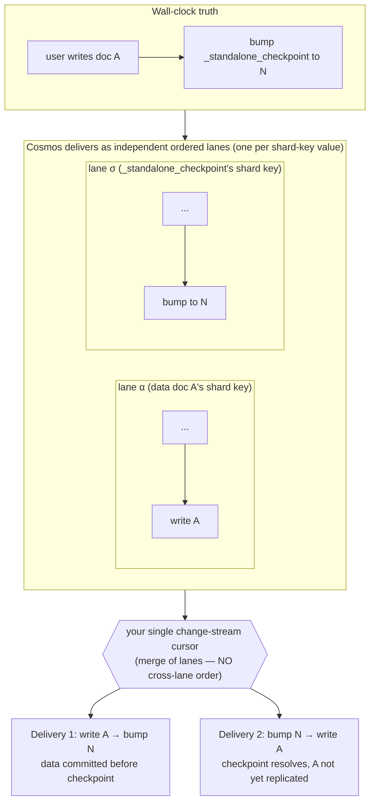

# Azure Cosmos DB for MongoDB vCore — Outstanding Items

> **Cosmos DB support is experimental.** This document tracks **unresolved design-level
> issues and follow-ups** for Cosmos DB replication — the things that are _not_ fixed
> by the current code and that a future contributor needs to be aware of.
>
> - User-visible behaviour differences live in [cosmos-db-limitations.md](./cosmos-db-limitations.md).
> - The checkpoint/LSN design lives in [cosmos-db-lsn-sentinel-checkpoints.md](./cosmos-db-lsn-sentinel-checkpoints.md).
> - This file is for _open_ items: known correctness gaps, detection gaps, and doc corrections still pending.

## Summary

| #   | Item                                                                                        | Kind                                         | Severity    | Fixable?                                            |
| --- | ------------------------------------------------------------------------------------------- | -------------------------------------------- | ----------- | --------------------------------------------------- |
| 1   | Cross-document ordering unguaranteed — affects checkpoint consistency and write checkpoints | Correctness (consistency + read-your-writes) | High — OPEN | Blocked on a source ordering guarantee (see routes) |
| 2   | Changing the source database is not detected                                                | Detection gap                                | Medium      | Yes (future work)                                   |
| 3   | Large initial snapshot can age out of the change-feed retention window                      | Operational                                  | Medium      | Yes (future work: incremental reprocessing)         |

---

## Background: what Cosmos actually guarantees about change ordering

Everything below hinges on one fact, so it is stated first.

Real **MongoDB** guarantees a **global** total order over the change stream: one oplog,
every event stamped with a monotonic `clusterTime`, delivered in that order. That global
order is the entire reason the standard `TimestampCheckpointImplementation` is correct.

**Cosmos does not provide a global order.** The strongest ordering statement in Microsoft's
documentation is for the **RU-based** API for MongoDB:

> "Changes to the items in the collection are captured in the order of their modification
> time and the sort order is guaranteed **per shard key**."
> — [Change streams in Azure Cosmos DB's API for MongoDB](https://learn.microsoft.com/en-us/azure/cosmos-db/mongodb/change-streams)

For **vCore / DocumentDB** (what PowerSync actually replicates from) the change-streams
documentation makes **no ordering guarantee at all**; it only states single-shard support
and a 400 MB change-feed log limit
([vCore change streams](https://docs.azure.cn/en-us/cosmos-db/mongodb/vcore/change-streams)).

### The "lane" model

Think of the change stream not as one global line of events, but as **N independent
ordered lanes — one per shard-key value — merged into the single cursor you read.** The
ordering guarantee lives _inside a lane_, not in the merge.

| Granularity                                       | Ordered? | Consequence                                                  |
| ------------------------------------------------- | -------- | ------------------------------------------------------------ |
| Same document (same `_id` ⇒ same shard-key value) | ✅ yes   | `fullDocument.i` sentinel matching is safe                   |
| Same shard-key value (one lane)                   | ✅ yes   | —                                                            |
| **Different shard-key values (different lanes)**  | ❌ no    | cross-document checkpoint & write-checkpoint logic is unsafe |
| Global (whole stream)                             | ❌ no    | the guarantee MongoDB has and Cosmos lacks                   |

"Per-document" safety is just the special case of the per-shard-key guarantee where two
events share an `_id`. Reasoning about a single document never leaves one lane; reasoning
across two documents does.

---

## 1. Cross-document change ordering is unguaranteed

**Status: OPEN — blocked on a concrete cross-document ordering guarantee.**

Checkpoints are driven by sentinel writes to dedicated `_powersync_checkpoints` documents,
which are separate documents from the data being replicated. Because the source guarantees
change order only per shard key — not across documents — a checkpoint sentinel can be delivered
ahead of data writes that preceded it. This puts two correctness properties at risk.

### The invariants (non-negotiable)

> **Checkpoint consistency.** A committed checkpoint must be a consistent cut: it must include
> every change that logically precedes it. A client must never observe a checkpoint that is
> missing an earlier change.

> **Write-checkpoint resolution.** A managed write checkpoint must never resolve before the
> corresponding source changes have been replicated into storage (read-your-writes).

Both are correctness requirements, not tunables. Resolving or committing even momentarily early
is unacceptable.

### Why the current Cosmos path cannot prove them

A batch/standalone checkpoint advances a sentinel counter in a `_powersync_checkpoints` document
and commits at the LSN of that sentinel's change event. A write checkpoint stores that sentinel
as its head and resolves once the replicated checkpoint reaches it.

The sentinel document and the data documents have different shard-key values — different ordering
lanes. The source guarantees order only within a lane (per shard key on the RU API; nothing
documented on vCore), not across the merge. So the sentinel's change event can be delivered before
data writes that were applied earlier. When that happens:

- **Checkpoint consistency:** the stream commits the checkpoint without having seen those earlier
  data writes, so the checkpoint is not a consistent cut — it omits changes that precede it, and a
  write that spans multiple documents can be split across two checkpoints.
- **Write-checkpoint resolution:** the head is reached and the write checkpoint resolves while the
  caller's data is still undelivered.

The data is not lost — it arrives later — but the checkpoint/resolution is premature.

This **cannot be fixed storage-side.** Deriving the boundary from the storage checkpoint / op id
produced _after_ the sentinel is observed does not help: that op id is produced _by_ the very
commit the stream performs when it observes the sentinel event, and it encodes only events buffered
_up to_ the sentinel. If an earlier data write hasn't crossed the lane merge yet, it isn't in that
batch and the op id cannot know it's missing. Closing the gap requires a cross-document "you have
received everything up to position X" high-water mark — which only exists if the source provides
cross-document ordering or completeness. **That is the unanswered question.**

### Empirical testing

Probe tests in the test suite exercise this scenario and record the change stream's delivery
order. On single-shard vCore, available testing has not observed cross-document reordering — the
sentinel has not been seen to overtake the data write that preceded it, including under concurrent
write load. This is consistent with single-shard behaving as one totally-ordered feed.

It is **evidence, not a guarantee**: testing covers a limited set of clusters and engine versions,
and it cannot manufacture a genuine multi-partition split on single-shard. An invariant cannot
rest on "not reproduced."

### Required guarantee

Satisfying the invariant requires a concrete, documented guarantee from the source database about
cross-document change ordering. The open questions, independent of any particular implementation:

1. Does the change stream deliver changes across different documents and collections in (or
   consistent with) their commit order — i.e. is there a cross-document / global ordering, rather
   than only a per-shard-key ordering?
2. Is there a monotonic, cross-document position (a timestamp, LSN, or continuation token) such
   that, once observed, every earlier change across all documents is guaranteed to have already
   been delivered — a completeness high-water mark?
3. How do these guarantees depend on cluster topology (single- vs multi-shard) and engine version?

Until one of these is answered affirmatively and in writing, cross-document ordering cannot be
assumed.

### Routes, keyed to the answer

- **If a usable cross-document ordering or completeness guarantee exists:** commit checkpoints and
  resolve write checkpoints only once the replicated position provably passes the boundary using
  that guaranteed signal. Both invariants are satisfied; the limitation is lifted on the guaranteed
  topologies.
- **If only per-shard-key ordering is guaranteed (no cross-document completeness):** the sentinel
  approach cannot prove either invariant. Two distinct consequences:
  - _Write-checkpoint resolution_ can be fixed by withdrawal: disable managed write checkpoints on
    Cosmos (fail closed, with a clear error). This removes only that feature.
  - _Checkpoint consistency_ cannot be withdrawn — it underpins ordinary replication for every
    client. Without a cross-document guarantee there is no sentinel placement that makes a checkpoint
    a provable consistent cut, so this becomes a core consistency limitation, not a feature toggle.
    It must be resolved (e.g. by a different consistency mechanism that does not depend on
    cross-document ordering) or accepted and documented as a limitation.
- **If no guarantee is available:** treat as the worst case above.

### Interim posture (until answered)

Because premature commit/resolution is unacceptable and no guarantee is available, the safe default
is: do not rely on Cosmos managed write checkpoints for read-your-writes (fail closed, or keep
behind the experimental flag with the invariant flagged as unverified); and treat checkpoint
consistency on Cosmos as **unverified** — surfaced honestly to users — rather than asserted, until
the cross-document ordering question is answered.

---

## 2. Changing the source database is not detected

**Severity: Medium (detection gap).**

Cosmos only supports cluster-level change streams, so the stream always opens on `admin`
with `allChangesForCluster` and filters namespaces in the pipeline. Cosmos resume tokens are
cluster-scoped, so they stay valid when only the database name changes.

On standard MongoDB, repointing a connection at a different source database invalidates the
stored position and forces a resync — a safeguard. On Cosmos that safeguard never fires:
replication silently continues from the old token, now filtered to the new (typically empty)
database.

This is documented for users in [cosmos-db-limitations.md](./cosmos-db-limitations.md)
("Changing the source database is not detected"), and the `resuming with a different source
database` test is skipped on Cosmos for this reason.

**Possible future fix:** persist the source database name alongside the LSN and validate it on
resume, raising `ChangeStreamInvalidatedError` on mismatch to force a resync.

---

## 3. Large initial snapshot vs. change-feed retention

**Severity: Medium (operational).**

Cosmos retains only a limited amount of change-feed history (a system-managed 400 MB log).
Initial replication snapshots, then resumes streaming from a position captured before the
snapshot. For a large or busy source, the snapshot can take long enough that this position
ages out of the retention window before streaming resumes — replication then restarts from
scratch and can loop.

In practice Cosmos initial replication is currently suited to datasets small enough to
snapshot well within the retention window.

**Planned fix:** incremental reprocessing — consume the change stream from the moment the
snapshot begins, instead of resuming from a single pre-snapshot position.
