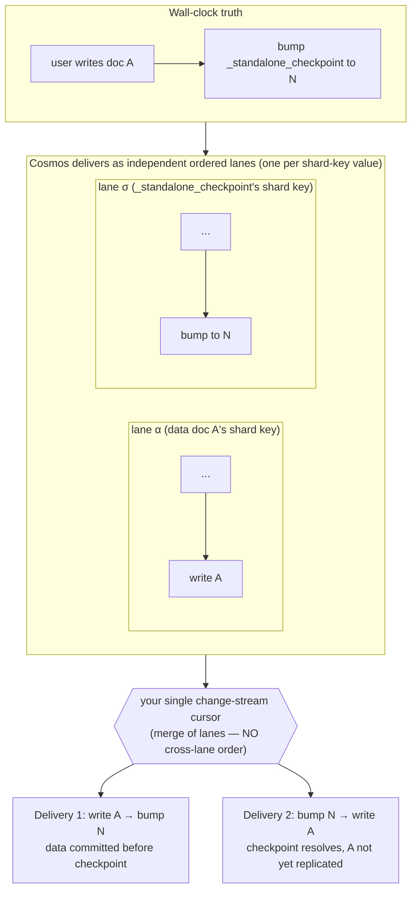

# Azure Cosmos DB for MongoDB vCore — Outstanding Items

> **Cosmos DB support is experimental.** This document tracks **unresolved design-level
> issues and follow-ups** for Cosmos DB replication — the things that are _not_ fixed
> by the current code and that a future contributor needs to be aware of.
>
> - User-visible behaviour differences live in [cosmos-db-limitations.md](./cosmos-db-limitations.md).
> - The checkpoint/LSN design lives in [cosmos-db-lsn-sentinel-checkpoints.md](./cosmos-db-lsn-sentinel-checkpoints.md).
> - This file is for _open_ items: known correctness gaps, detection gaps, and doc corrections still pending.

## Summary

| #   | Item                                                                      | Kind                           | Severity | Fixable?                                    |
| --- | ------------------------------------------------------------------------- | ------------------------------ | -------- | ------------------------------------------- |
| 1   | Write checkpoints can resolve before the corresponding data is replicated | Correctness (read-your-writes) | High     | No — inherent to Cosmos ordering            |
| 2   | Changing the source database is not detected                              | Detection gap                  | Medium   | Yes (future work)                           |
| 3   | Large initial snapshot can age out of the change-feed retention window    | Operational                    | Medium   | Yes (future work: incremental reprocessing) |

---

## Background: what Cosmos actually guarantees about change ordering

Everything below hinges on one fact, so it is stated first.

Real **MongoDB** guarantees a **global** total order over the change stream: one oplog,
every event stamped with a monotonic `clusterTime`, delivered in that order. That global
order is the entire reason the standard `TimestampCheckpointImplementation` is correct.

**Cosmos does not provide a global order.** The strongest ordering statement in Microsoft's
documentation is for the **RU-based** API for MongoDB:

> "Changes to the items in the collection are captured in the order of their modification
> time and the sort order is guaranteed **per shard key**."
> — [Change streams in Azure Cosmos DB's API for MongoDB](https://learn.microsoft.com/en-us/azure/cosmos-db/mongodb/change-streams)

For **vCore / DocumentDB** (what PowerSync actually replicates from) the change-streams
documentation makes **no ordering guarantee at all**; it only states single-shard support
and a 400 MB change-feed log limit
([vCore change streams](https://docs.azure.cn/en-us/cosmos-db/mongodb/vcore/change-streams)).

### The "lane" model

Think of the change stream not as one global line of events, but as **N independent
ordered lanes — one per shard-key value — merged into the single cursor you read.** The
ordering guarantee lives _inside a lane_, not in the merge.

| Granularity                                       | Ordered? | Consequence                                          |
| ------------------------------------------------- | -------- | ---------------------------------------------------- |
| Same document (same `_id` ⇒ same shard-key value) | ✅ yes   | `fullDocument.i` sentinel matching is safe           |
| Same shard-key value (one lane)                   | ✅ yes   | —                                                    |
| **Different shard-key values (different lanes)**  | ❌ no    | cross-document write-checkpoint resolution is unsafe |
| Global (whole stream)                             | ❌ no    | the guarantee MongoDB has and Cosmos lacks           |

"Per-document" safety is just the special case of the per-shard-key guarantee where two
events share an `_id`. Reasoning about a single document never leaves one lane; reasoning
across two documents does.

---

## 1. Write checkpoints can resolve before the data is replicated

**Severity: High (read-your-writes consistency). Not data loss.**

### What happens

A managed write checkpoint stores a replication head and resolves once the replicated
checkpoint reaches it. On Cosmos the head is the `_standalone_checkpoint` sentinel `N`,
and resolution fires when the stream commits at or beyond `N`.

The user's data write lives in one document (lane α); the sentinel bump lives in
`_standalone_checkpoint` (lane σ). These are different shard-key values, so the merge can
deliver the sentinel event **before** the data-write event ("Delivery 2" above). When that
happens the stream commits the checkpoint at `N` and the write checkpoint resolves while
the caller's data is still undelivered — the client is told its write is durable/visible
before it is queryable in synced data.

The data is **not lost**: the data-write event is still delivered and replicated later. The
defect is purely _ordering/timing_ of write-checkpoint resolution, and the skew is bounded
only by inter-lane delivery timing, which Cosmos does not bound.

### Why it cannot be fixed storage-side

The first instinct is "resolve from the storage checkpoint / op*id produced \_after* the
sentinel is observed." This does **not** work: that op*id is produced \_by* the very commit
the stream performs when it observes the sentinel event. It encodes only the events buffered
_up to_ the sentinel — if the data write hasn't crossed the lane merge yet, it isn't in that
batch and the op_id cannot know it's missing. There is no second, independent signal.

The only thing that would close the gap is a cross-document "you have received everything up
to position X" high-water mark — i.e. a resume token with global-completeness semantics —
which only exists if there is a global order. Cosmos does not provide one. On a single-shard
cluster it _might_ behave that way in practice, but that is undocumented and the design
deliberately does not rely on it.

**Conclusion:** this is an inherent limitation of Cosmos change streams, not an implementation
bug. The current sentinel approach (the standalone-sentinel head) is the ceiling achievable
without a global order.

### Possible (partial) mitigations — none are guarantees

- Empirically bound and document the worst-case inter-lane skew on target clusters, and gate
  write-checkpoint resolution behind a delay ≥ that skew. Heuristic, not a guarantee.
- Investigate whether single-shard vCore resume tokens carry usable completeness semantics.
  If Microsoft ever commits to global order on single-shard, resolution could wait for the
  token to pass the sentinel. Currently undocumented — do not rely on it.

---

## 2. Changing the source database is not detected

**Severity: Medium (detection gap).**

Cosmos only supports cluster-level change streams, so the stream always opens on `admin`
with `allChangesForCluster` and filters namespaces in the pipeline. Cosmos resume tokens are
cluster-scoped, so they stay valid when only the database name changes.

On standard MongoDB, repointing a connection at a different source database invalidates the
stored position and forces a resync — a safeguard. On Cosmos that safeguard never fires:
replication silently continues from the old token, now filtered to the new (typically empty)
database.

This is documented for users in [cosmos-db-limitations.md](./cosmos-db-limitations.md)
("Changing the source database is not detected"), and the `resuming with a different source
database` test is skipped on Cosmos for this reason.

**Possible future fix:** persist the source database name alongside the LSN and validate it on
resume, raising `ChangeStreamInvalidatedError` on mismatch to force a resync.

---

## 3. Large initial snapshot vs. change-feed retention

**Severity: Medium (operational).**

Cosmos retains only a limited amount of change-feed history (a system-managed 400 MB log).
Initial replication snapshots, then resumes streaming from a position captured before the
snapshot. For a large or busy source, the snapshot can take long enough that this position
ages out of the retention window before streaming resumes — replication then restarts from
scratch and can loop.

In practice Cosmos initial replication is currently suited to datasets small enough to
snapshot well within the retention window.

**Planned fix:** incremental reprocessing — consume the change stream from the moment the
snapshot begins, instead of resuming from a single pre-snapshot position.
