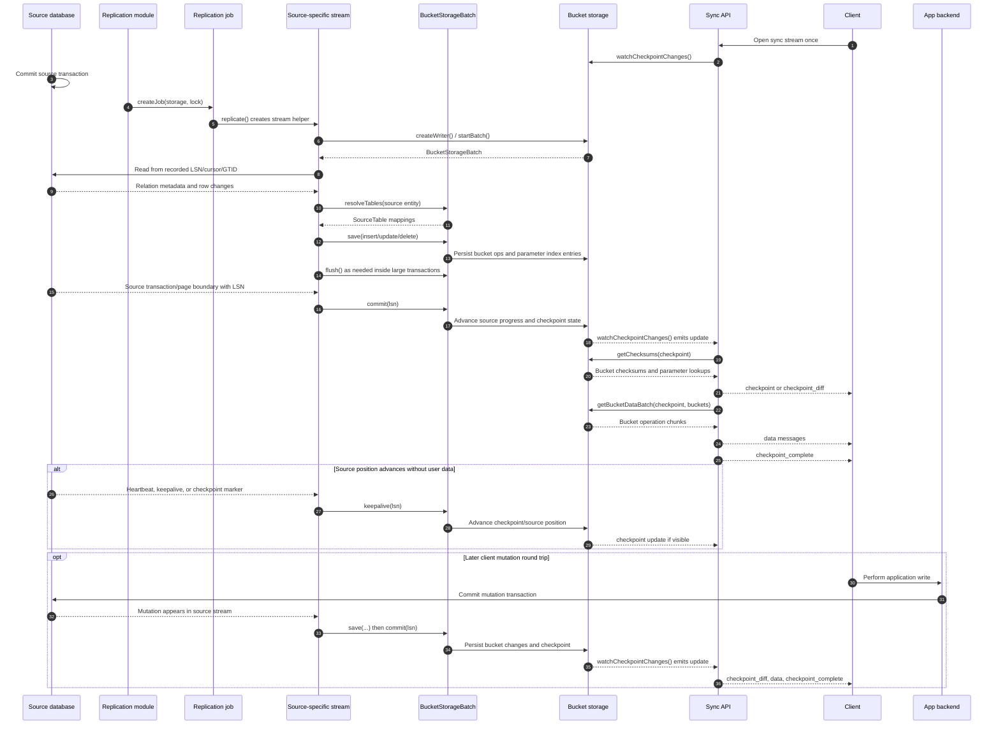

# Replication Protocol Specs

This directory describes the internal PowerSync replication protocol: how a source database connector, the shared `service-core` replication loop, and a bucket storage implementation cooperate to produce the checkpoints, bucket data, and parameter data consumed by the sync API.

This is not the client wire protocol itself. For the client-facing stream messages, start with [sync-protocol.md](../specs/sync-protocol.md). For bucket invariants and operation semantics, see [bucket-properties.md](../storage/bucket-properties.md) and [compacting-operations.md](../storage/compacting-operations.md).

## Outside-In Overview

PowerSync clients sync from the service using checkpoint, checkpoint diff, bucket data, and checkpoint-complete messages described in [sync-protocol.md](../specs/sync-protocol.md). Those messages are generated from bucket storage. Replication is the process that keeps bucket storage up to date with a configured source database.

Automatic source schema change detection is source-specific and optional. A replication module can support schema metadata changes in its streaming loop, or it can require operators to deploy a new sync config after changing source schemas. That deployment creates replication processing work. Depending on source and storage support, it may create a separate processing stream or append a processing sync config to an existing stream for incremental reprocessing.

At a high level:

1. One or more sync configs are persisted as part of a replication stream in bucket storage.
2. A replication module registers a source-specific replicator with `ReplicationEngine`.
3. The replicator starts one replication job for each storage stream that should currently replicate.
4. The job's `replicate()` method creates a source-specific stream, such as `WalStream` or `ChangeStream`.
5. The source stream performs snapshot work if required, then consumes ongoing source changes.
6. Each source row change is resolved to one or more tracked `SourceTable` records and evaluated against the sync config state selected for that stream.
7. Storage writes bucket operations and parameter index entries through a `BucketStorageBatch`.
8. A batch `commit(lsn)` or `keepalive(lsn)` advances persisted source progress and any checkpoint state that is safe to expose.
9. Once checkpoints are unblocked, bucket storage exposes a new checkpoint.
10. The sync API watches checkpoint changes and streams updated checksums, bucket data, and checkpoint request acknowledgements to clients.

## End-To-End Sequence

The usual mutation-to-client path looks like this. The source-specific stream may be Postgres WAL, MongoDB change streams, MySQL binlog, SQL Server CDC, Convex document deltas, or a future connector using the same storage writer workflow.

The client opens a single sync stream request. Checkpoint lines, bucket data chunks, keepalives, and checkpoint-complete messages are then streamed over that one response; the client does not make a separate request for changed bucket data after receiving a checkpoint.

The optional mutation block is shown later so the main path starts with the standard read/sync flow. When a client mutation is involved, the write normally reaches the source database through the application's own backend or write path. PowerSync replication then observes that source transaction and streams the resulting bucket changes back to the client.

The `flush()` call may persist partial work inside a large source transaction, but `commit(lsn)` should only happen after a source transaction boundary. A single PowerSync checkpoint can include multiple complete source transactions when the stream batches them together.

In storage modes that support incremental reprocessing, a replication stream can contain an active sync config and a processing sync config at the same time. Table resolution and row writes use the storage instance's canonical parsed sync config set, so compatible persisted bucket and parameter definitions can be reused while only new or changed definitions need snapshot work. The processing config stays invisible to the sync API until it has a consistent checkpoint.

## Reading Path

1. [Core concepts](./01-core-concepts.md): common vocabulary used by the replication code and storage implementations.
2. [Replication lifecycle](./02-replication-lifecycle.md): how `ReplicationEngine`, `AbstractReplicator`, and `AbstractReplicationJob` manage work.
3. [Source connector overview](./03-source-connector-overview.md): what Postgres, MongoDB, MySQL, SQL Server, Convex, and future source modules provide.
4. [Storage writer overview](./04-storage-writer-overview.md): how source streams write source changes into bucket storage.
5. [Snapshots and streaming](./05-snapshots-and-streaming.md): the consistency model for initial replication and ongoing change streams.
6. [Checkpoints](./06-checkpoints.md): how storage checkpoints, checkpoint requests, bucket checksums, and parameter lookups fit together.
7. [Source modules](./07-source-modules.md): current source-specific implementations and differences.
8. [AI agent plans](./08-ai-agent-plans.md): phased implementation plans for adding a new replication module.
9. [Resolve tables flow](./09-resolve-tables-flow.md): the `resolveTables` lifecycle, source table discovery, and table metadata state.

## Primary Code Anchors

- Replication orchestration: [`AbstractReplicator`](../../packages/service-core/src/replication/AbstractReplicator.ts)
- Replication job contract: [`AbstractReplicationJob`](../../packages/service-core/src/replication/AbstractReplicationJob.ts)
- Source module base class: [`ReplicationModule`](../../packages/service-core/src/replication/ReplicationModule.ts)
- Source API contract: [`RouteAPI`](../../packages/service-core/src/api/RouteAPI.ts)
- Per-stream storage API: [`SyncRulesBucketStorage`](../../packages/service-core/src/storage/SyncRulesBucketStorage.ts)
- Storage writer API: [`BucketStorageBatch`](../../packages/service-core/src/storage/BucketStorageBatch.ts)
- Client sync consumer: [`streamResponse`](../../packages/service-core/src/sync/sync.ts)

## Existing Deep Dives

- [storage-v3.md](../storage/storage-v3.md): storage version 3 data model.
- [parameter-lookups.md](../storage/parameter-lookups.md): parameter lookup storage and compaction.
- [initial-replication.md](../modules/postgres/initial-replication.md): historical and current Postgres initial replication design.
- [convex-write-checkpoints.md](../modules/convex/convex-write-checkpoints.md): marker collection rationale for checkpoint requests, also known in older code and docs as managed write checkpoints.
- [convex](../modules/convex/README.md): Convex-specific snapshot, schema-change, and checkpoint request notes.
